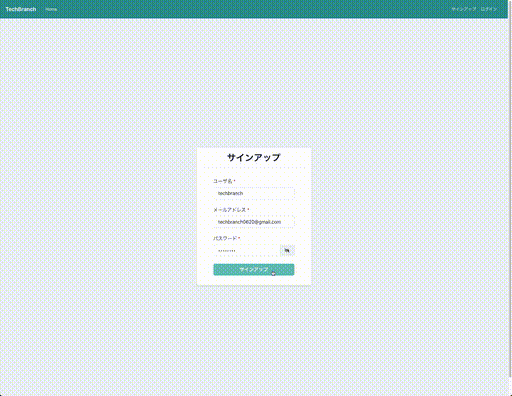
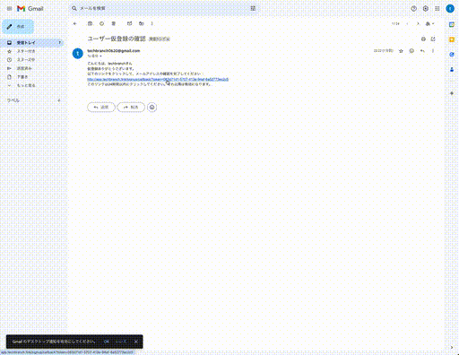
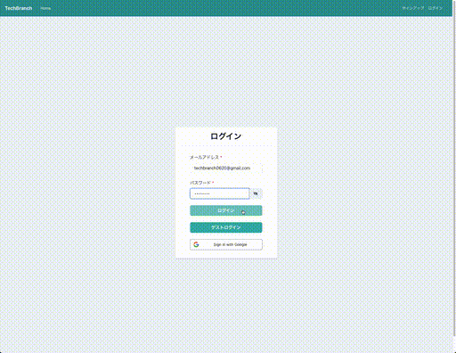
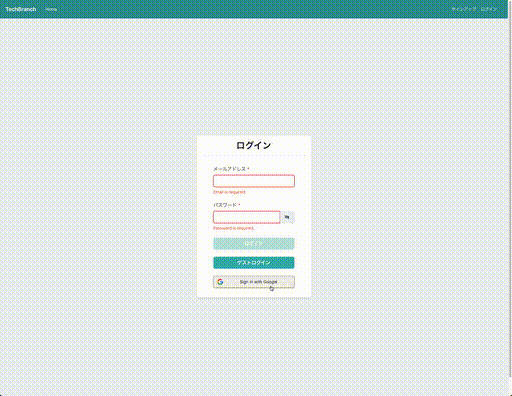
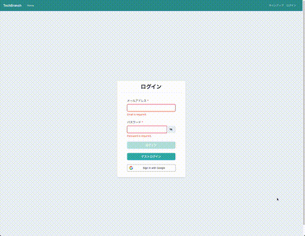
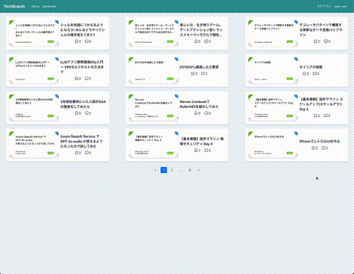
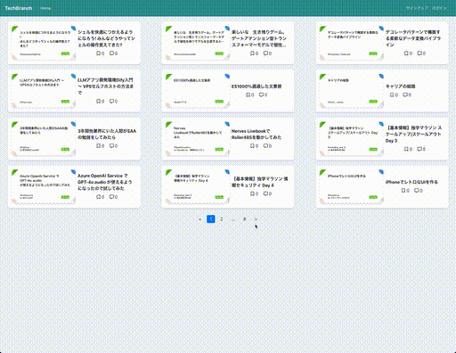
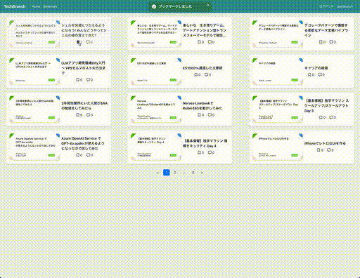
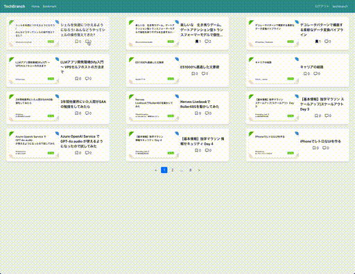

# techbranch

技術サイト・ブログの記事を一元管理するアプリ

## 使用技術

## URL

- [アプリケーション](https://app.techbranch.link/)
- [API ドキュメント](https://api.techbranch.link/docs)

## テストアカウント

ログイン画面からゲストログインを押下ください。

## 機能

- サインアップ

  - 登録後、ユーザ認証のメール送信する

  - メールでの URL リンクから認証すると本登録する

- ログイン
  - Email・パスワードでのログインする
  - Google アカウントでのログインする
- 記事一覧
  - 記事の一覧を表示する
  - 記事をクリックすると記事本文へ遷移する
- ブックマーク
  - ブックマークを登録する
  - ブックマークを削除する
  - ブックマーク一覧からブックマークした記事の一覧を表示する
- コメント
  - コメントを登録する
  - コメントを表示する

<table>
  <tr>
    <th>サインアップ</th>
    <th>メールユーザ認証</th>
  </tr>
  <tr>
    <td></td>
    <td></td>
  </tr>
  <tr>
    <th>ログイン</th>
    <th>Googleログイン</th>
  </tr>
  <tr>
    <td></td>
    <td></td>
  </tr>
  <tr>
    <th>ゲストログイン</th>
    <th>ログアウント</th>
  </tr>
  <tr>
    <td></td>
    <td></td>
  </tr>
  <tr>
    <th>記事一覧</th>
    <th>ブックマーク</th>
  </tr>
  <tr>
    <td></td>
    <td></td>
  </tr>
  <tr>
    <th>コメント</th>
  </tr>
  <tr>
    <td></td>
  </tr>
</table>

## AWS 構成図

## ER 図

